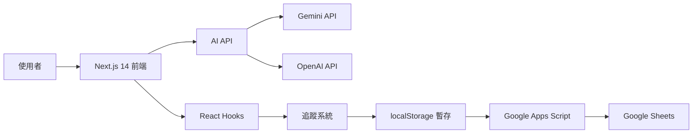

<div align="center">

# 🤱 產婦 AI 問答平台
### Baby Landing - Maternal AI Knowledge Platform

<p align="center">
  <strong>整合待產知識學習與 AI 智慧問答的產婦衛教平台</strong><br>
  提供完整的使用者學習追蹤功能，助力準媽媽安心待產
</p>

<p align="center">
  
  
  
  
</p>

<p align="center">
  
  
  
</p>

</div>

---

## 🔗 重要連結

<table>
<tr>
<td align="center" width="33%">
<a href="https://chatgpt3a01.github.io/maternal-ai-platform/">
<br>
<b>🌐 線上 Demo</b><br>
<sub>立即體驗平台功能</sub>
</a>
</td>
<td align="center" width="33%">
<a href="https://github.com/ChatGPT3a01/maternal-ai-platform">
<br>
<b>💻 GitHub 倉庫</b><br>
<sub>查看原始碼與文件</sub>
</a>
</td>
<td align="center" width="33%">
<a href="https://docs.google.com/spreadsheets/d/1x49JHHsD_pSXQ9v8J2KLugcstJxz1Y5koj3on8x5Fks/edit">
<br>
<b>📊 追蹤資料表</b><br>
<sub>使用者行為數據分析</sub>
</a>
</td>
</tr>
<tr>
<td align="center">
<a href="https://docs.google.com/forms/d/1pWj9TwGCWUt0cZGmtGdVg2iITi7bbpKc6dXhwyi3qRw/viewform">
<b>📝 前測問卷</b>
</a>
</td>
<td align="center">
<a href="https://docs.google.com/forms/d/1dwJhVsQFOEuR18w3wKZn8Z3Nu4td4OXuPnC_HMFQVZc/viewform">
<b>📝 後測問卷</b>
</a>
</td>
<td align="center">
<a href="docs/SETUP_GUIDE.md">
<b>📖 完整設置指南</b>
</a>
</td>
</tr>
</table>

---

## ✨ 專案特色

<table>
<tr>
<td width="50%">

### 📚 完整知識庫
- 待產注意事項完整指南
- 產兆辨識與判斷方法
- 產程進展詳細說明
- 各種減痛方法介紹

### 🤖 AI 智慧問答
- 支援 Gemini & OpenAI 雙引擎
- 自然語言提問
- 情境化預設問題
- 即時個人化解答

</td>
<td width="50%">

### 📊 學習追蹤系統
- 頁面瀏覽記錄
- 閱讀進度追蹤
- 提問歷史記錄
- 學習成效分析

### 🎨 優質使用體驗
- 響應式設計（支援所有裝置）
- 直覺式操作介面
- 完整無障礙支援
- 前後測問卷評估

</td>
</tr>
</table>

---

## 🏗️ 技術架構



<div align="center">

| 技術層 | 使用工具 |
|:------:|:---------|
| **前端框架** | Next.js 14 (App Router) |
| **UI 組件** | shadcn/ui + Tailwind CSS 4 |
| **程式語言** | TypeScript 5 |
| **AI 整合** | Google Gemini & OpenAI |
| **資料追蹤** | Google Sheets + Apps Script |
| **狀態管理** | React Hooks + localStorage |
| **部署平台** | GitHub Pages (靜態輸出) |

</div>

---

## 🚀 快速開始

### 📋 環境需求

- Node.js 18.17 或更高版本
- npm 或 yarn 套件管理器
- Google 帳號（用於追蹤系統）
- Gemini 或 OpenAI API Key（用於 AI 問答）

### ⚡ 安裝步驟

```bash
# 1. Clone 專案
git clone https://github.com/ChatGPT3a01/maternal-ai-platform.git
cd maternal-ai-platform

# 2. 安裝相依套件
npm install

# 3. 設定環境變數
cp .env.local.example .env.local
# 編輯 .env.local，填入您的 API Keys 和設定值

# 4. 啟動開發伺服器
npm run dev

# 5. 開啟瀏覽器訪問
# http://localhost:3000
```

### ⚙️ 環境變數設定

| 變數名稱 | 說明 | 必填 | 範例 |
|---------|------|:----:|------|
| `NEXT_PUBLIC_GOOGLE_WEBAPP_URL` | Google Apps Script Web App URL | ✅ | `https://script.google.com/...` |
| `NEXT_PUBLIC_TRACKING_SHEET_ID` | Google Sheets ID | ⭕ | `1x49JHHsD_pSXQ9v8J2KLu...` |
| `NEXT_PUBLIC_PRETEST_URL` | 前測問卷連結 | ✅ | `https://docs.google.com/forms/...` |
| `NEXT_PUBLIC_POSTTEST_URL` | 後測問卷連結 | ✅ | `https://docs.google.com/forms/...` |

> 💡 **詳細設置步驟**：請參考 [完整設置指南](docs/SETUP_GUIDE.md)

---

## 📁 專案結構

```
maternal-ai-platform/
├── 📂 src/
│   ├── 📂 app/                    # Next.js App Router 頁面
│   │   ├── 📄 page.tsx           # 🏠 首頁 (Baby Landing)
│   │   ├── 📂 baby/              # 👶 Baby Landing 頁面
│   │   ├── 📂 labor-care/        # 📋 待產注意事項
│   │   ├── 📂 labor-knowledge/   # 📚 待產知識系統
│   │   ├── 📂 quiz/              # 📝 測驗問卷
│   │   ├── 📂 chat/              # 💬 AI 問答
│   │   └── 📂 symptoms/          # 🩺 症狀頁面
│   ├── 📂 components/            # React 組件
│   │   ├── 📂 Knowledge/         # 知識展示組件
│   │   ├── 📂 Chat/              # 聊天介面組件
│   │   ├── 📂 Tracking/          # 追蹤組件
│   │   └── 📂 Layout/            # 佈局組件
│   ├── 📂 lib/                   # 工具函數
│   │   └── 📂 tracking/          # 追蹤系統核心
│   ├── 📂 hooks/                 # React Hooks
│   ├── 📂 data/                  # 知識庫 JSON
│   └── 📂 types/                 # TypeScript 型別定義
├── 📂 docs/                      # 📖 文件
│   ├── 📄 SETUP_GUIDE.md        # 完整設置指南
│   └── 📄 google-apps-script.js # Apps Script 程式碼
└── 📂 public/                    # 靜態資源
```

---

## 🎯 主要功能

<details open>
<summary><b>📚 知識學習系統</b></summary>

- **待產注意事項**：完整的待產準備清單
- **待產知識**：
  - 🔍 認識產兆：如何辨識真假陣痛
  - 📈 產程進展：三個產程的詳細說明
  - 💊 減痛方法：藥物與非藥物減痛選項

</details>

<details>
<summary><b>🤖 AI 問答功能</b></summary>

- 支援自然語言提問
- 整合 Gemini 和 OpenAI 雙引擎
- 知識點旁的「詢問 AI 更多」快捷按鈕
- 情境化預設問題推薦
- 即時回應與個人化解答

</details>

<details>
<summary><b>📊 學習追蹤系統</b></summary>

自動追蹤以下資料並上傳至 Google Sheets：

- **頁面瀏覽** 📄：記錄訪問的頁面和停留時間
- **閱讀記錄** 📖：記錄滾動深度和閱讀時間
- **提問記錄** 💬：記錄所有 AI 提問內容和來源
- **學習進度** 📊：計算完成章節數和進度百分比

</details>

<details>
<summary><b>📝 測驗評估系統</b></summary>

- **前測問卷**：學習前的知識水平評估
- **後測問卷**：學習後的成效評估
- **成效分析**：比較學習前後的進步幅度

</details>

---

## 🔄 追蹤系統架構

```
┌─────────────────────────────────────────────────────────┐
│                      使用者行為                          │
└────────────────────┬────────────────────────────────────┘
                     ↓
┌─────────────────────────────────────────────────────────┐
│  React Hooks (usePageView, useReadingProgress, ...)     │
└────────────────────┬────────────────────────────────────┘
                     ↓
┌─────────────────────────────────────────────────────────┐
│           Analytics Service (TrackingQueue)             │
└────────────────────┬────────────────────────────────────┘
                     ↓
┌─────────────────────────────────────────────────────────┐
│        localStorage 暫存 (批次佇列，最多 100 筆)         │
└────────────────────┬────────────────────────────────────┘
                     ↓
┌─────────────────────────────────────────────────────────┐
│         Google Apps Script Web App (API 端點)           │
└────────────────────┬────────────────────────────────────┘
                     ↓
┌─────────────────────────────────────────────────────────┐
│            Google Sheets (永久資料儲存)                  │
└─────────────────────────────────────────────────────────┘
```

### ✨ 追蹤機制特色

| 特色 | 說明 |
|:----:|:-----|
| ⚡ **批次上傳** | 累積 10 筆資料或間隔 30 秒自動上傳 |
| 🔄 **失敗重試** | 上傳失敗自動重試，最多 3 次 |
| 💾 **離線暫存** | 網路斷線時暫存於 localStorage |
| 🔒 **匿名追蹤** | 使用 UUID 識別，不記錄個資 |
| 🔗 **跨 Tab 同步** | 多分頁資料自動同步 |

---

## 🧪 測試

### 本地開發測試

```bash
# 啟動開發伺服器
npm run dev

# 開啟瀏覽器訪問
open http://localhost:3000
```

### 追蹤功能測試清單

- [ ] 開啟瀏覽器開發者工具 (F12) → Console 標籤
- [ ] 瀏覽「待產注意事項」頁面，停留 10 秒以上
- [ ] 瀏覽「待產知識 - 認識產兆」，完整滾動到底部
- [ ] 點選「詢問 AI 更多」按鈕，選擇預設問題
- [ ] 觀察 Console 是否有追蹤訊息輸出
- [ ] 檢查 localStorage 資料：`localStorage.getItem('maternal-tracking-queue')`
- [ ] 等待 30 秒或累積 10 個操作
- [ ] 確認 [Google Sheets](https://docs.google.com/spreadsheets/d/1x49JHHsD_pSXQ9v8J2KLugcstJxz1Y5koj3on8x5Fks/edit) 有新增資料

> 💡 **詳細測試步驟**：請參考 [完整設置指南 - 測試追蹤功能](docs/SETUP_GUIDE.md#測試追蹤功能)

---

## 📚 技術細節

<details>
<summary><b>📖 閱讀完成判定邏輯</b></summary>

章節標記為「已完成」需**同時滿足**以下條件：

```typescript
停留時間 ≥ 預估閱讀時間 × 50%  // 例如：5 分鐘文章需停留 2.5 分鐘
AND
滾動深度 ≥ 80%                 // 必須滾動到接近底部
```

</details>

<details>
<summary><b>⚡ 批次上傳機制</b></summary>

**自動觸發條件**：
1. 累積 **10 筆**追蹤資料
2. 距離上次上傳超過 **30 秒**

**失敗處理**：
- 自動重試最多 **3 次**
- 每次重試間隔 **1 秒**
- 失敗後保留於 localStorage

**離線支援**：
- 網路斷線時暫存於 localStorage
- 最多暫存 **100 筆**資料
- 恢復網路後自動同步

</details>

<details>
<summary><b>🔒 匿名追蹤機制</b></summary>

```typescript
// 自動生成匿名 UUID
const userId = `user_${timestamp}_${randomString}`

// 儲存位置
localStorage.setItem('maternal-user-id', userId)

// 資料保護
✅ 不記錄 IP 位址
✅ 不記錄個人資訊
✅ 僅記錄學習行為數據
```

</details>

---

## 🚀 部署

### GitHub Pages 自動部署

本專案已設定 GitHub Actions 自動部署至 GitHub Pages。

**每次推送到 `master` 分支時自動觸發：**

1. 自動建置 Next.js 靜態網站
2. 部署到 GitHub Pages
3. 更新線上網站

**訪問網址**：`https://chatgpt3a01.github.io/maternal-ai-platform/`

### 手動部署

```bash
# 建置靜態網站
npm run build

# 匯出靜態檔案
npm run export

# 生成的檔案位於 out/ 目錄
```

---

## 📖 文件資源

| 文件 | 說明 |
|:-----|:-----|
| 📘 [完整設置指南](docs/SETUP_GUIDE.md) | 詳細的環境設置和部署教學 |
| 🔧 [Google Apps Script](docs/google-apps-script.js) | 追蹤系統後端程式碼 |
| 📋 [問卷題目](docs/survey-questions.md) | 前測/後測問卷題目設計 |

---

## ❓ 常見問題

<details>
<summary><b>Q1: 追蹤資料沒有寫入 Google Sheets？</b></summary>

**檢查清單**：
- ✅ 確認 `.env.local` 中的 `NEXT_PUBLIC_GOOGLE_WEBAPP_URL` 正確
- ✅ 確認 Google Apps Script 部署時選擇「所有人」可存取
- ✅ 確認已累積 10 筆資料或等待 30 秒
- ✅ 檢查瀏覽器 Console 是否有錯誤訊息

詳細解決方法請參考 [設置指南](docs/SETUP_GUIDE.md#常見問題)

</details>

<details>
<summary><b>Q2: 如何重置學習進度？</b></summary>

在瀏覽器 Console 執行：

```javascript
// 清除所有追蹤資料
localStorage.removeItem('maternal-completed-sections');
localStorage.removeItem('maternal-tracking-queue');
localStorage.removeItem('maternal-user-id');
localStorage.removeItem('maternal-show-pretest-dialog');

// 重新載入頁面
location.reload();
```

</details>

<details>
<summary><b>Q3: 支援哪些 AI 模型？</b></summary>

目前支援以下模型（可在 Chat 頁面選擇）：

**Gemini 系列**：
- gemini-2.0-flash-exp
- gemini-1.5-pro
- gemini-1.5-flash

**OpenAI 系列**：
- gpt-4o
- gpt-4-turbo
- gpt-3.5-turbo

</details>

---

## ⚠️ 免責聲明

> 本平台提供的資訊僅供參考，不能取代專業醫療診斷與治療。如有任何健康疑慮，請諮詢您的醫師或其他醫療專業人員。

---

## 📄 授權

此專案僅供**研究和教育用途**使用。

---

## 🤝 貢獻

歡迎提交 Issue 或 Pull Request 來改進這個專案！

---

## 📞 聯絡資訊

如有任何問題或建議，歡迎透過以下方式聯繫：

- 📧 GitHub Issues: [提交問題](https://github.com/ChatGPT3a01/maternal-ai-platform/issues)
- 💬 Discussions: [參與討論](https://github.com/ChatGPT3a01/maternal-ai-platform/discussions)

---

<div align="center">

### ⭐ 如果這個專案對您有幫助，請給我們一個星星！

**最後更新**：2026-01-15 | **版本**：1.0.0 | **框架**：Next.js 14 + TypeScript

Made with ❤️ for expecting mothers

</div>
